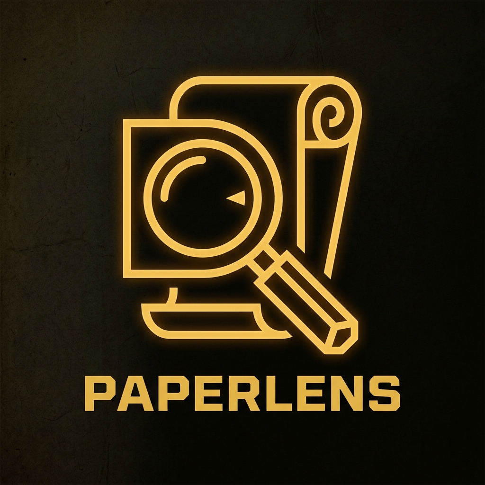

<div align="center">
  

  # PaperLens

  *Illuminate the unseen architecture of your documents. AI Research Paper Companion.*

  <br />

  [](https://www.youtube.com/watch?v=YOUR_YOUTUBE_VIDEO_ID_HERE)
  *(Click above to watch the full PaperLens walkthrough)*
</div>

---

## 🌟 Overview
PaperLens is an advanced AI-powered tool designed to help researchers, students, and professionals extract deep insights from PDFs. Upload any research paper and generate concept maps, Feynman-style explanations, and interrogate your research effortlessly!

## ✨ Features
- **Smart PDF Analysis**: Extract and synthesize complex academic papers.
- **Concept Mapping**: Visually understand the relationships between different topics within a document.
- **Feynman Explanations**: Complex topics simplified to their core principles.
- **Interactive Chat**: Interrogate your research with our intelligent chat interface.
- **Private Library**: Securely save your analysis sessions and documents.

## 🚀 Setup Guidelines

### Prerequisites
- Node.js (v18 or higher)
- npm or yarn or pnpm
- Firebase account for authentication/database
- Gemini API key (or other LLM keys required)

### Installation

1. **Clone the repository:**
   ```bash
   git clone https://github.com/your-username/paperlens.git
   cd paperlens
   ```

2. **Install dependencies:**
   ```bash
   npm install
   ```

3. **Configure Environment Variables:**
   Create a `.env.local` file in the root directory and add the following keys:
   ```env
   NEXT_PUBLIC_FIREBASE_API_KEY=your_api_key
   NEXT_PUBLIC_FIREBASE_AUTH_DOMAIN=your_auth_domain
   NEXT_PUBLIC_FIREBASE_PROJECT_ID=your_project_id
   NEXT_PUBLIC_FIREBASE_STORAGE_BUCKET=your_storage_bucket
   NEXT_PUBLIC_FIREBASE_MESSAGING_SENDER_ID=your_sender_id
   NEXT_PUBLIC_FIREBASE_APP_ID=your_app_id
   GEMINI_API_KEY=your_gemini_api_key
   ```

4. **Run the development server:**
   ```bash
   npm run dev
   ```

5. **Open the App:**
   Navigate to [http://localhost:3000](http://localhost:3000) in your browser.

## 🤝 Contributing
We love community contributions! Please read our [Contributing Guidelines](CONTRIBUTING.md) to learn how to get started.

## 📄 License
This project is licensed under the MIT License.
